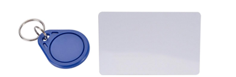

# MODUL_06 : RADIO FREQUENCY IDENTIFICATION

### Sihir di Balik Kartu Identifikasi

Pernahkah kamu bertanya-tanya bagaimana kartu *kamar hotel* bisa membuka pintu kamar hanya dengan ditempelkan, atau bagaimana dengan mesin absensi yang dengan mendekatkan kartu ke dinding absen akan secara otomatis dilakukan? Tidak ada baterai di dalam kartu-kartu tersebut, namun mereka bisa mengirimkan informasi.

Teknologi ini bernama **RFID (Radio Frequency Identification)**. Jika sensor ultrasonik menggunakan suara untuk "melihat" jarak, RFID menggunakan gelombang radio untuk "membaca" identitas.

### 1. Dua Pemeran Utama: Reader & Tag

Dalam sistem RFID, selalu ada percakapan antara dua perangkat:

1. **RFID Reader (MFRC522):** Ini adalah "Satpam" yang bertugas menjaga pintu. Ia terus-menerus memancarkan medan magnet lemah di sekitarnya sambil bertanya, "Siapa di sana?".
   
   

2. **RFID Tag (Kartu atau Gantungan Kunci):** Ini adalah "KTP" milik benda atau orang. Yang unik adalah, kartu ini **tidak punya baterai**. Ia mendapatkan tenaga secara ajaib dari medan magnet yang dipancarkan oleh Reader saat didekatkan. Begitu ia "bangun" karena mendapat tenaga, ia akan meneriakkan nomor identitas uniknya (UID).

### 2. UID: Nama yang Tidak Bisa Diganti

Setiap kartu atau tag RFID memiliki kode unik yang disebut **UID (Unique Identifier)**. Bayangkan ini seperti NIK pada KTP atau nomor rangka pada motor. Tidak ada dua kartu di dunia ini yang memiliki UID yang sama persis.

Saat kamu mendekatkan kartu ke Reader:

- Reader menangkap UID tersebut.

- Arduino menerima UID dari Reader.

- Arduino mengecek di dalam memorinya: *"Apakah kode `A1 B2 C3 D4` ini terdaftar sebagai pemilik rumah?"*

- Jika **YA**, Arduino menyuruh Servo membuka pintu. Jika **TIDAK**, Arduino menyuruh Buzzer berbunyi.

### 3. Komunikasi SPI: Jalur Cepat

Berbeda dengan LCD yang biasanya menggunakan I2C (2 kabel), modul RFID MFRC522 biasanya menggunakan jalur **SPI (Serial Peripheral Interface)**.

Mengapa? Karena data identitas harus dikirim dengan sangat cepat dan akurat agar orang tidak perlu menunggu lama di depan pintu. Jalur SPI menggunakan 4 kabel data utama (MOSI, MISO, SCK, dan SS). Memang terlihat lebih rumit, tapi ini adalah harga yang harus dibayar untuk kecepatan data.

### 4. Keamanan dan Jarak

RFID yang kita gunakan (RC522) bekerja pada frekuensi **13.56 MHz**. Ini adalah tipe jarak dekat (*Proximity*). Kamu harus menempelkan kartu dalam jarak 0-3 cm.

**Kenapa tidak dibuat jarak jauh saja?** Bayangkan jika RFID pintu rumahmu bisa membaca kartu dari jarak 5 meter. Saat kamu sedang tidur di dalam rumah dan dompetmu berada di dekat jendela, pintu bisa terbuka sendiri karena mendeteksi kartu di dalam dompetmu. Jarak pendek adalah fitur keamanan, bukan kekurangan.

### 5. Logika Praktik: Read vs Write

Kartu RFID sebenarnya bukan hanya bisa dibaca, tapi juga bisa **ditulisi** data (seperti saldo atau nama). Namun, untuk level dasar, kita akan fokus pada fungsi **Read-Only**:

1. **Scanning:** Alat terus memantau apakah ada kartu yang mendekat.

2. **Validation:** Membandingkan UID yang terbaca dengan daftar UID yang sudah kita simpan di dalam kode.

3. **Action:** Menggerakkan aktuator berdasarkan cocok atau tidaknya identitas tersebut.

### Challenge!

Buatkan satu simulasi di wokwi dengan menggunakan rfid untuk menyalakan 2 lampu. Kartu pertama (TAG 1) akan digunakan untuk menyalakan lampu 1,
Kartu kedua (TAG 2) akan digunakan untuk menyalakan lampu 2,
Kartu ketiga (TAG 3) akan digunakan untuk mematikan lampu 1 dan 2.

