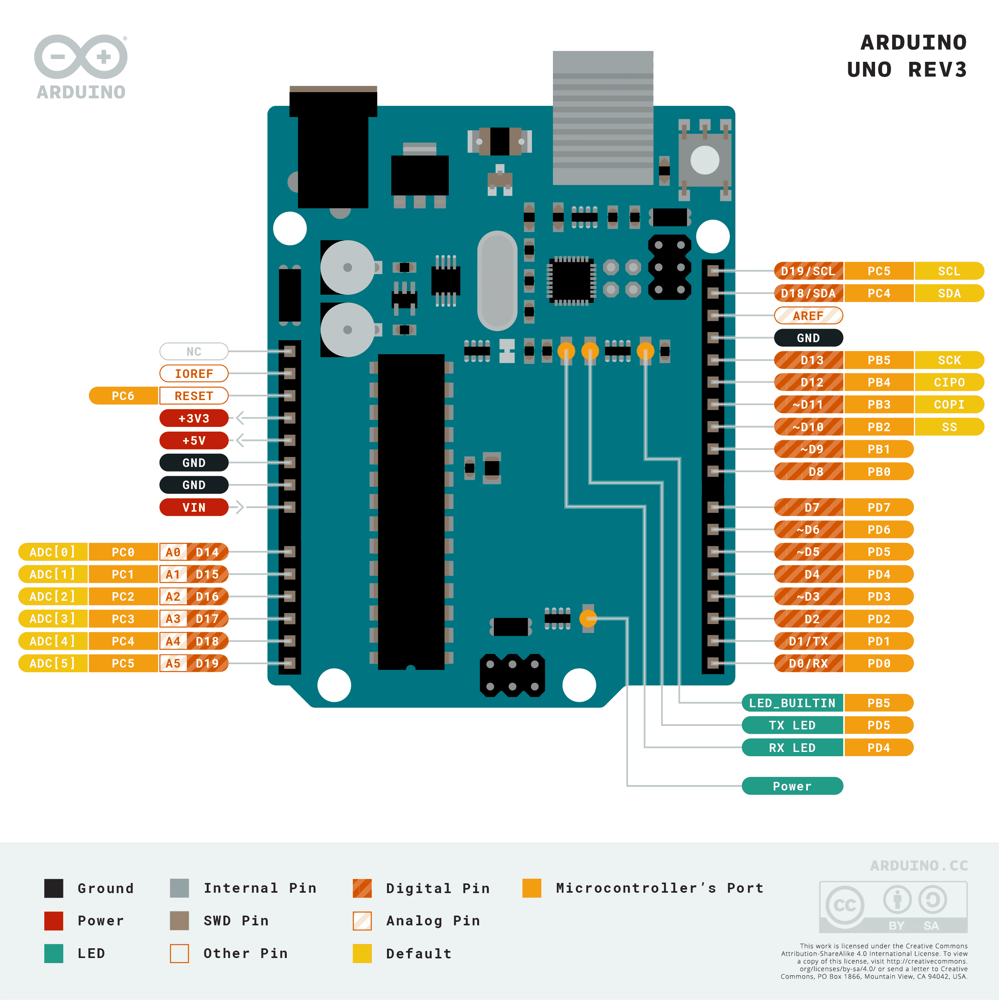

# MODUL_01 : ARDUINO SEBAGAI OTAK

### 1. APA ITU ARDUINO ?

Jika dianalogikan arduino mungkin bisa dianggap sebagai otak. Bayangkan jika kamu secara tidak sengaja memegang panci yang panas, apa yang sekiranya akan terjadi? tanganmu akan tersentak menjauh dalam hitungan milidetik. Apa yang sebenarnya terjadi di sana?

Kulitmu (sebagai sensor) menangkap suhu panas yang ekstrem, lalu sarafmu mengirimkan pesan darurat ke otak. Otakmu dengan cepat memutuskan, "Ini bahaya! Tarik tangan sekarang!", dan seketika itu juga otot lenganmu (sebagai aktuator) bergerak.

Disini, **arduino** adalah replika elektronik dari sistem tersebut. Di dalam dunia robotika / elektronika, arduino bertindak sebagai **otak**. alat tersebut tidak bisa melakukan apa-apa sendirian, arduino membutuhkan "indera" untuk mengetahui dunia luar dan "otot" untuk melakukan aksi. Tanpa instruksi yang kamu tanamkan, arduino hanyalah sekeping papan plastik dan logam yang tidak bernyawa.

### 2. ANATOMI HARDWARE ARDUINO

Sebelum kita memberikan instruksi, kita harus mengenal bagian-bagian tubuh Arduino agar kita tidak salah memberikan perintah. Jika kamu melihat papan Arduino Uno-mu, kamu akan melihat banyak lubang kecil yang kita sebut sebagai **Pin**. Koleksi pin pada komponen elektronika sering kali disebut sebagai **PinOut**, gambar dibawah adalah gambar **PinOut** dari perangkat arduino uno R3



Area pertama yang harus kamu perhatikan adalah **Power House**. Ini adalah sistem pencernaan Arduino. Di sinilah perangkat tersebut mendapatkan energi, baik itu melalui kabel USB yang terhubung ke laptopmu atau melalui baterai. Di sini juga terdapat pin **5V** (sebagai sumber tenaga) dan **GND (Ground)**. Kamu bisa membayangkan GND sebagai jalur pulang listrik ke bumi, tanpa jalur pulang, listrik tidak akan pernah mau mengalir.

Kemudian, ada dua jenis "pintu" utama pada otak ini. Pertama adalah **Digital Pins** (nomor 0-13). Pintu ini sangat tegas, hanya mengetahui dua hal "Ada Listrik" atau "Tidak Ada Listrik". Ini seperti saklar lampu di rumahmu yang hanya punya pilihan ON atau OFF. Kedua adalah **Analog Pins** (A0-A5). Pintu ini jauh lebih sensitif. Ia bisa merasakan tingkatan, seperti seberapa redup lampu di ruangan atau seberapa kencang kamu memutar sebuah keran air.

### 3. BAGAIMANA CARA BERKOMUNIKASI DENGAN ARDUINO ?

Arduino adalah pengikut yang sangat patuh, tapi sedikit kaku. tidak mengerti bahasa manusia seperti, "Tolong nyalakan lampu kalau sudah gelap." Kita harus menerjemahkan keinginan kita ke dalam urutan langkah-langkah yang logis, atau yang biasa disebut **Algoritma**. Jika dibawa ke dunia nyata bayangkan saja kamu akan berbicara dengan orang german tetapi kamu tidak bisa berbahasa german dan orang german itu pun tidak bisa berbahasa indonesia, apa yang perlu dilakukan? kita perlu menggunakan "Translator" agar dapat berbicara pada orang tersebut. Setiap kali kamu menulis program (yang kita sebut sebagai *Sketch*), kamu akan selalu menemui dua ruangan utama:

Pertama, **`void setup()`**. Bayangkan ini sebagai ritual "Persiapan Bangun Tidur". Sebelum memulai hari, kamu harus memastikan semuanya siap. Di sini, kita memberi tahu Arduino bagian mana yang akan bekerja. Misalnya: "Pin nomor 13, kamu akan bertugas sebagai Tangan (Output) ya!". Bagian ini hanya dijalankan satu kali saja saat Arduino baru menyala.

Kedua, **`void loop()`**. Ini adalah rutinitas utama. Sesuai namanya, bagian ini akan dijalankan berulang-ulang selamanya selama Arduino mendapatkan listrik. Di sinilah letak nyawa dari robotmu. Kamu bisa menuliskan instruksi: "Cek sensor mata, kalau ada orang, sapa dia. Jika tidak, tetap diam." Arduino akan menanyakan hal itu ribuan kali dalam satu detik tanpa pernah merasa bosan.

### 4. TROUBLESHOOTING

Dalam belajar robotika / elektronika, melakukan kesalahan adalah bagian dari proses. Mungkin nanti programmu tidak bisa berjalan (error). Jangan panik. Arduino sebenarnya sangat komunikatif jika kamu tahu cara mendengarkannya. Karena pada dasarnya kode tersebut adalah "Translator" kita, "Translator" tersebut akan memberitahu dimana letak kesalahan kita yang kemudian bisa kita perbaiki.

Seringkali, kesalahan hanya karena hal sepele: kamu lupa menaruh tanda titik koma (`;`) di akhir kalimat perintah, yang membuat Arduino bingung kapan sebuah instruksi berakhir. Atau mungkin, kamu salah menuliskan nama perintah karena Arduino sangat sensitif terhadap huruf besar dan kecil.

```arduino
// Dalam pemrograman, penamaan adalah hal yang sensitif
nama != Nama
Liquidcrystal_i2c != liquidCrystal_12C


// Dalam pemrograman dengan bahasa C / C++ simbol titik koma(;) sangat diperlukan
printf("halo dunia") // jika tidak menggunakan titik koma maka program akan error
printf("halo dunia"); // program akan dieksekusi sebagaimana mestinya


// Dalam pemrograman pastikan setiap tanda kurung "(), [], {}" memiliki pasangannya
void() // Tanda kurung atau Parentheses
array[] // Tanda kurung siku atau Bracket
function{} // Tanda kurung kurawal atau Curly Braces
```

Gunakanlah **Serial Monitor** di laptopmu. Ini adalah cara Arduino memberitahu kepadamu tentang apa yang di rasakan. Jika tidak bisa melihat benda di depannya, arduino akan mengirimkan pesan lewat kabel USB agar kamu bisa membacanya di layar. Ingat, robot tidak pernah salah, yang ada hanyalah instruksi yang kurang tepat atau kabel yang kurang kencang.

### 5. LANGKAH BERIKUTNYA

Sekarang setelah kamu mengenal siapa yang memegang kendali, saatnya kita memberikan Arduino "Indera" agar ia bisa mulai merasakan dunia di sekitarnya. Mari kita lanjut ke pembahasan mengenai **Sensor dan Aktuator**.