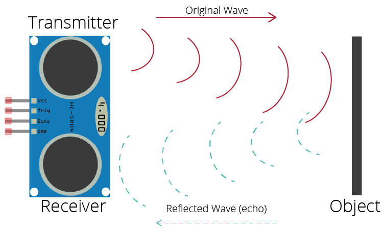

# MODUL_02 : SENSOR & AKTUATOR

### MENGHUBUNGKAN OTAK DENGAN DUNIA NYATA

Pada materi sebelumnya, kita sudah sepakat bahwa Arduino adalah "Otak" yang cerdas. Namun, bayangkan jika otakmu berada di dalam sebuah kotak gelap tanpa mata, telinga, atau tangan. Secerdas apa pun otak itu, ia tidak akan bisa berbuat apa-apa. Ia terjebak.

Agar Arduino bisa berguna, ia membutuhkan dua hal: **Sensor** untuk merasakan keadaan di sekitarnya (seperti indera manusia) dan **Aktuator** untuk melakukan tindakan fisik (seperti otot manusia). Mari kita bedah bagaimana cara mereka bekerja sama.

### 1. SENSOR SEBAGAI INDRA

Sensor adalah mata dan kulit bagi robotmu. Tugasnya sederhana namun krusial: mengambil fenomena fisik di dunia nyata seperti cahaya, panas, atau jarak lalu mengubahnya menjadi bahasa yang dimengerti Arduino, yaitu **sinyal listrik**.

Di dunia robotika, ada dua cara sensor berbicara kepada Arduino:

- **Sensor Digital:** seperti saklar lampu. Ia hanya memberi tahu dua hal: "Ada sesuatu" atau "Tidak ada apa-apa". Contohnya adalah tombol tekan atau sensor gerak yang hanya peduli apakah ada orang yang lewat atau tidak.

- **Sensor Analog:** jauh lebih detail. Ia tidak hanya bilang "ada", tapi "seberapa banyak". Jika ini adalah sensor cahaya, ia bisa memberi tahu Arduino bahwa ruangan sedang "sedikit redup", "terang benderang", atau "gelap total".

Sebagai contoh kita akan menggunakan sensor ultrasonik sebagai "indra" tersebut. Sensor ini bekerja persis seperti kelelawar. Sensor ini memiliki dua "mata" kecil yang sebenarnya adalah mulut dan telinga.

- Satu mata (Trigger) akan meneriakkan suara ultrasonik yang sangat tinggi (sampai telinga manusia tidak bisa mendengarnya).

- Suara itu akan memantul pada benda di depannya dan kembali lagi.

- Mata satunya (Echo) akan mendengarkan pantulan itu.

Arduino kemudian menghitung: "Berapa lama waktu yang dibutuhkan suara itu untuk pergi dan pulang?" Semakin lama waktunya, berarti benda itu semakin jauh. Itulah cara robotmu "melihat" jarak tanpa perlu menyentuh bendanya.

### 2. AKTUATOR SEBAGAI OTOT

Jika sensor adalah pemberi informasi, maka **Aktuator** adalah pelaksana perintah. Tanpa aktuator, robotmu hanya bisa "melihat" tanpa bisa "bertindak".

Ada banyak jenis otot yang bisa kita berikan pada robot:

- **LED dan Buzzer:** Ini adalah cara robot berekspresi. LED memberikan isyarat visual (seperti kedipan mata), sementara Buzzer memberikan isyarat suara (seperti teriakan atau alarm).

- **Motor Servo:** Berbeda dengan motor mainan yang berputar liar, Servo adalah otot yang sangat sopan dan presisi. Kamu bisa memerintahkannya: "Tolong angkat lenganmu tepat 45 derajat," dan ia akan melakukannya dengan akurat. Ini sangat cocok untuk membuat sendi robot atau pintu otomatis.

### 3. JALUR TOL INFORMASI

Pernahkah kamu membayangkan bagaimana kabel-kabel yang sangat banyak bisa mengirimkan data yang berbeda-beda tanpa tertukar? Dalam dunia robotika, Arduino memiliki "bahasa isyarat" atau protokol komunikasi agar ia bisa mengobrol dengan perangkat lain (seperti LCD, sensor canggih, atau bahkan komputer lain).

**Bayangkan protokol ini sebagai jenis-jenis jalur distribusi logistik:**

##### A. UART (Universal Asynchronous Receiver-Transmitter) : *Telepon Dua Arah*

Ini adalah komunikasi yang paling sering kamu gunakan tanpa kamu sadari. Setiap kali kamu menggunakan kabel USB untuk mengirim kode dari laptop ke Arduino atau melihat data di *Serial Monitor*, kamu sedang menggunakan UART.

- **Cara Kerja:** Ia hanya butuh dua kabel utama: **TX** (Transmit/Mengirim) dan **RX** (Receive/Menerima).

- **Analogi:** Seperti dua orang yang sedang berbicara lewat telepon. Apa yang diucapkan mulut orang pertama (TX) harus didengar oleh telinga orang kedua (RX), dan sebaliknya. Sederhana, tapi biasanya hanya bisa dilakukan oleh dua perangkat saja.

##### B. I2C (Inter-Integrated Circuit) : *Grup WhatsApp*

Seperti yang sempat kita bahas, I2C adalah penyelamat saat kita ingin menghubungkan banyak perangkat (seperti layar LCD dan sensor suhu) hanya dengan dua kabel data (**SDA** dan **SCL**).

- **Cara Kerja:** Setiap perangkat yang terhubung memiliki "Alamat" unik. Arduino akan berteriak, "Halo perangkat alamat 0x27 (LCD), tolong tampilkan tulisan ini!". Perangkat lain akan mendengar, tapi karena alamatnya tidak cocok, mereka akan mengabaikannya.

- **Analogi:** Seperti grup WhatsApp. Semua pesan lewat di jalur yang sama, tapi hanya orang yang "dimention" yang akan merespons pesan tersebut. Sangat ringkas dan bersih.

##### C. SPI (Serial Peripheral Interface) : *Grup Orkestra*

Jika kamu membutuhkan kecepatan tinggi—misalnya untuk mengirim data gambar ke layar berwarna atau membaca data dari kartu SD—maka SPI adalah pilihannya.

- **Cara Kerja:** SPI menggunakan sistem "Pemimpin dan Pengikut" (*Master & Slave*). Ia butuh lebih banyak kabel (biasanya 4 kabel: MOSI, MISO, SCK, dan SS).

- **Analogi:** Seperti sebuah grup orkestra. Ada satu konduktor (Arduino) yang memimpin dengan sangat cepat dan tegas menggunakan tongkat ketukan (Clock). Semua pemain musik (sensor/layar) harus mengikuti irama ketukan yang sangat cepat itu agar datanya tidak berantakan. Ini adalah jalur komunikasi paling kencang di antara ketiganya.

### 4. MENYATUKAN SEGALANYA

Untuk membuat robot yang pintar, kamu hanya perlu mengikuti satu pola pikir sederhana yang disebut **IPO (Input - Process - Output)**:

- **Input:** Arduino membaca sensor. *(Contoh: "Jarak benda di depan saya adalah 5 cm")*

- **Process:** Arduino berpikir berdasarkan instruksi yang kamu tulis. *(Contoh: "Jika jarak kurang dari 10 cm, itu artinya bahaya!")*

- **Output:** Arduino memerintahkan aktuator bertindak. *(Contoh: "Buzzer berbunyi, Servo, tutup pintu!")*

Selama kamu memegang prinsip dasar ini, kamu bisa membuat robot apa pun, mulai dari tempat sampah pintar hingga mobil yang bisa menghindari rintangan sendiri.
