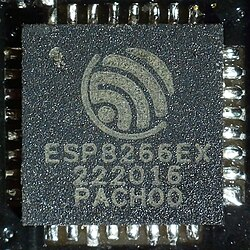
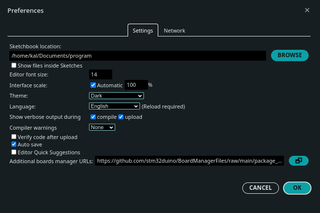

# MODUL_07 : ESP8266 & ESP32

### Selamat Tinggal Keterbatasan

Jika Arduino Uno adalah sebuah komputer desktop yang tangguh namun statis, maka seri ESP adalah sebuah *smartphone* canggih yang ringkas. Kita berpindah ke platform ini karena satu alasan utama yaitu **Konektivitas**. Tanpa perlu modul tambahan yang mahal, modul dev-board ini sudah memiliki Wi-Fi dan Bluetooth yang tertanam langsung di dalam chip-nya.




### 1. Chip yang Berbeda, Kekuatan yang Berbeda

Di dalam arsip ini, kita akan sering menemui dua saudara:

- **ESP8266 (NodeMCU):** Chip legendaris yang memulai revolusi IoT murah. Modul ini memiliki satu inti otak (core) dan cukup untuk proyek sensor tunggal.
  
  - [Pinout ESP8266 bisa diakses disini](https://components101.com/development-boards/nodemcu-esp8266-pinout-features-and-datasheet)

- **ESP32:** Kakak yang jauh lebih bertenaga. Modul ini memiliki **Dual-Core** (dua otak yang bekerja bersamaan), memori yang jauh lebih besar, dan sensor internal seperti sensor sentuh (*touch sensor*) dan sensor magnet (*hall effect*).
  
  - [Pinout ESP32 bisa diakses disini]((https://mischianti.org/doit-esp32-dev-kit-v1-high-resolution-pinout-and-specs/))

### 2. Aturan Emas / Golden Rules: Logika 3.3 Volt

Ini adalah bagian terpenting dalam transisi ini. Arduino Uno bekerja dengan tegangan 5V, namun keluarga ESP bekerja pada **3.3V**. **Jangan pernah sekali-kali memasukan input 5V pada board ESP kecuali pada pin khusus untuk 5V atau Vin.**

- **Input:** Jika kamu memasukkan kabel 5V ke pin data ESP, chip tersebut bisa terbakar.

- **Output:** Sinyal "HIGH" dari ESP hanya 3.3V. Beberapa komponen (seperti beberapa jenis relay atau LCD lama) mungkin tidak akan "sadar" bahwa mereka sedang diberi perintah karena tegangannya dianggap terlalu kecil.

### 3. Power Management & Sleep Mode

Salah satu keunggulan ESP yang tidak dimiliki Arduino Uno adalah kemampuan **Deep Sleep**. Robot IoT seringkali ditenagai baterai. ESP bisa "tidur mati suri" (hanya mengonsumsi listrik sangat kecil) dan bangun secara otomatis hanya saat perlu mengirim data, lalu tidur lagi. Ini membuat proyekmu bisa bertahan berbulan-bulan hanya dengan satu baterai. 

[Deep sleep tutorial untuk ESP32](https://randomnerdtutorials.com/esp32-deep-sleep-arduino-ide-wake-up-sources/)

[Deep sleep tutorial untuk ESP8266](https://randomnerdtutorials.com/esp8266-deep-sleep-with-arduino-ide/)

### 4. Menghubungkan ESP Dengan Arduino IDE

Untuk bisa memprogram board ini, kita perlu mengunduh library board external melewati board manager di Arduino IDE. Atau tambahkan url ini di bagian **Preferences** pada kolom **Additional boards manager URLs**

```url
https://dl.espressif.com/dl/package_esp32_index.json,http://arduino.esp8266.com/stable/package_esp8266com_index.json
```



Setelah library board terpasang, silahkan test board ESP dengan mengupload example code BLINK.


